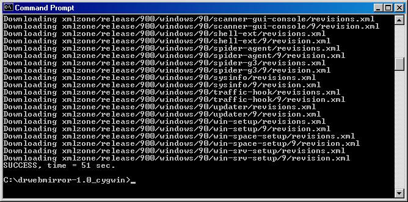
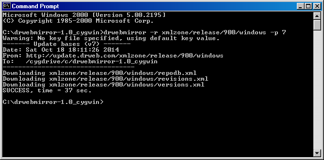

# DrWebMirror

## Description

**Project mission:** To develop a simple tool for creating a mirror of DrWeb update server.

**Programming language:** Plain C (with POSIX or Windows API).

**License:** [GNU GPL v3](http://www.gnu.org/copyleft/gpl.html) (main program), various (3rd party components).

**Homepage:** https://github.com/rudolf-sikorski/drwebmirror

## Screenshots




## Compilation

### Unix-like systems

```bash
mkdir build
cd build
cmake -G "Unix Makefiles" -DCMAKE_BUILD_TYPE:STRING=Release -DCMAKE_INSTALL_PREFIX:STRING=/usr/local ..
make
sudo make install
```

### Windows (MinGW)

```bat
md build
cd build
set PATH=C:\MinGW\bin;%PATH%
cmake -G "MinGW Makefiles" -DCMAKE_BUILD_TYPE:STRING=Release ..
mingw32-make
```

### Windows (Visual Studio 2003+)

```bat
md build
cd build
cmake -G "Visual Studio 7 .NET 2003" ..
cmake --build . --config Release
```

### Windows (OpenWatcom)

```bat
md build
cd build
cmake -G "Watcom WMake" -DCMAKE_BUILD_TYPE:STRING=Release ..
wmake
```

## Submitting Bugs

* GitHub issues tracker: https://github.com/rudolf-sikorski/drwebmirror/issues
* Email: Rudolf Sikorski <[rudolf.sikorski@freenet.de](mailto:rudolf.sikorski@freenet.de)>

## Help

```console
$ ./drwebmirror --help
DrWebMirror 1.14, tool for creating a mirror of DrWeb update server.
Homepage: https://github.com/rudolf-sikorski/drwebmirror

Usage: drwebmirror <options>

Options:
  -k,  --keyfile=FILE              set key file
  -u,  --user=NUMBER               set UserID number from key file
  -m,  --md5=STRING                set MD5 sum of key file
  -H,  --syshash=STRING            set X-DrWeb-SysHash header
  -a,  --agent=STRING              set custom User Agent
  -s,  --server=ADDRESS[:PORT]     set update server address and port
  -S,  --server-fb=ADDRESS[:PORT]  set fallback update server address and port
       --http-user=USER            set username for HTTP connection
       --http-password=PASS        set password for HTTP connection
       --http-version=VER          set HTTP protocol version (1.0 or 1.1)
  -p,  --proto=PROTO               set update protocol (4, 5, 5.2, 7 or A)
  -r,  --remote=PATH               set remote directory or file
  -l,  --local=DIR                 set local directory
       --proxy=ADDRESS[:PORT]      set HTTP proxy address and port
       --proxy-user=USER           set username for HTTP proxy
       --proxy-password=PASS       set password for HTTP proxy
  -f,  --fast                      use fast checksums checking (dangerous)
  -v,  --verbose                   show verbose output
  -V,  --verbose-full              show even more verbose output
  -h,  --help                      show this help

Example:

  drwebmirror -k drweb32.key -s update.drweb.com -p 4 -r unix/500 -l .

Known update servers:

  update.drweb.com         update.msk.drweb.com     update.msk3.drweb.com
  update.msk4.drweb.com    update.msk5.drweb.com    update.msk6.drweb.com
  update.msk7.drweb.com    update.msk8.drweb.com    update.msk9.drweb.com
  update.msk10.drweb.com   update.msk11.drweb.com   update.msk12.drweb.com
  update.msk13.drweb.com   update.msk14.drweb.com   update.msk15.drweb.com
  update.us.drweb.com      update.us1.drweb.com     update.fr1.drweb.com
  update.kz.drweb.com      update.nsk1.drweb.com    update.geo.drweb.com

Known remote directories and update protocol versions:

|-----------------------------------+---------------------------------+-------|
|           DrWeb Version           |    Remote directory or file     | Prot. |
|-----------------------------------+---------------------------------+-------|
| 4.33 for Windows                  | windows                         |   4   |
|                                   | 433/windows                     |   4   |
| 4.33 for Windows + Antispam       | 433/vr/windows                  |   4   |
| 4.33 for Windows Server           | servers/433/windows             |   4   |
|-----------------------------------+---------------------------------+-------|
| 4.44 for Windows                  | 444/windows                     |   4   |
| 4.44 for Windows + Antispam       | 444/vr/windows                  |   4   |
| 4.44 for Windows Server           | 444/servers/windows             |   4   |
|-----------------------------------+---------------------------------+-------|
| 5.00 for Novell NetWare           | netware/500                     |   4   |
| 5.01 for Novell NetWare           | netware/700                     |   4   |
|-----------------------------------+---------------------------------+-------|
| 5.0 for Windows                   | 500/windows                     |  4/5  |
|                                   | 500/winold/windows              |  4/5  |
| 5.0 Security Space for Windows    | 500/sspace/windows              |  4/5  |
| 5.0 for Windows Server            | 500/servers/windows             |  4/5  |
|                                   | 500/servers/nt4srv/windows      |  4/5  |
| 5.0/6.0 for Microsoft Exchange    | 500/exchange/windows            |  4/5  |
| WCL 5.0                           | 500/winconsole/windows          |  4/5  |
|-----------------------------------+---------------------------------+-------|
| 6.0 for Windows                   | x86/600/av/windows              |  4/5  |
|                                   | x64/600/av/windows              |  4/5  |
| 6.0 Security Space for Windows    | x86/600/sspace/windows          |  4/5  |
|                                   | x64/600/sspace/windows          |  4/5  |
| 6.0 for Windows Server            | x86/600/servers/windows         |  4/5  |
|                                   | x64/600/servers/windows         |  4/5  |
| 6.0 for IBM Lotus Domino          | x86/600/lotus/windows           |  4/5  |
|                                   | x64/600/lotus/windows           |  4/5  |
| 6.0 for Kerio WinRoute            | x86/600/keriowinroute/windows   |  4/5  |
|                                   | x64/600/keriowinroute/windows   |  4/5  |
| 6.0 for Kerio MailServer          | x86/600/keriomailserver/windows |  4/5  |
|                                   | x64/600/keriomailserver/windows |  4/5  |
|-----------------------------------+---------------------------------+-------|
| Vaderetro Anti-Spam Plug-In       | unix/maild/vr/i386              |  4/5  |
|                                   | unix/maild/vr/i386/solaris9     |  4/5  |
|-----------------------------------+---------------------------------+-------|
| 5.0/6.0 for Unix                  | unix/500                        |  4/5  |
| 6.0/8.0 for Unix                  | unix/700                        |  4/5  |
| 9.0 for Unix                      | unix/900                        |  4/5  |
| 10.0/10.1 for Unix/macOS          | unix/1000/vdb                   |  4/5  |
|                                   | unix/1000/dws                   |  4/5  |
|                                   | unix/1000/macosx                |  4/5  |
| 11.0/11.1 for Unix/macOS          | unix/1100/version               | 5/5.2 |
|                                   | unix/1100/vdb                   | 5/5.2 |
|                                   | unix/1100/vdb64                 | 5/5.2 |
|                                   | unix/1100/dws                   | 5/5.2 |
|                                   | unix/1100/macosx                | 5/5.2 |
|                                   | unix/1100/antispam              | 5/5.2 |
| 11.1 for Unix                     | unix/1110/version               |  5.2  |
|                                   | unix/1110/vdb                   |  5.2  |
|                                   | unix/1110/vdb64                 |  5.2  |
|                                   | unix/1110/dws                   |  5.2  |
|                                   | unix/1110/antispam              |  5.2  |
|-----------------------------------+---------------------------------+-------|
| 12.0 Beta for macOS               | unix/macosx                     |   5   |
|                                   | unix/1100/vdb64                 |   5   |
|                                   | unix/1100/dws                   |   5   |
|-----------------------------------+---------------------------------+-------|
| 9.0 LiveDisk                      | livecd/900/windows              |  4/5  |
|-----------------------------------+---------------------------------+-------|
| 7.0 for Windows                   | xmlzone/release/700/av          |   7   |
| 7.0 Security Space for Windows    | xmlzone/release/700/sspace      |   7   |
| 7.0 for Windows Server            | xmlzone/release/700/servers     |   7   |
|-----------------------------------+---------------------------------+-------|
| 8.0 for Windows                   | xmlzone/release/800/av          |   7   |
| 8.0 Security Space for Windows    | xmlzone/release/800/sspace      |   7   |
| 8.0 for Windows Server            | xmlzone/release/800/servers     |   7   |
|-----------------------------------+---------------------------------+-------|
| 9.0/9.1 for Windows               | xmlzone/release/900/windows     |   7   |
| 10.0 for Windows                  | xmlzone/release/1000/windows    |   7   |
| 11.0 for Windows                  | xmlzone/release/1100/windows    |   7   |
| 11.5 for Windows                  | xmlzone/release/1150/windows    |   7   |
| 12.0 for Windows                  | xmlzone/release/1200/windows    |   7   |
|-----------------------------------+---------------------------------+-------|
| 11.0 Beta for Windows             | xmlzone/beta/1100/windows       |   7   |
| 12.0 Beta for Windows             | xmlzone/beta/1200/windows       |   7   |
| 12.5 Beta for Windows             | xmlzone/beta/1250/windows       |   7   |
|-----------------------------------+---------------------------------+-------|
| for Symbian                       | 500/symbian/drwebce.lst         |   A   |
| for Windows Mobile                | wince/600/drwebce.lst           |   A   |
| 6.0-8.0 for Android               | android/6.1/drwebce.lst         |   A   |
| 9.0-9.2 for Android               | android/9/version.lst           |   A   |
| 10.0 for Android/BlackBerry       | android/10/version.lst          |   A   |
| 10.1 for Android/BlackBerry       | android/10.1/version.lst        |   A   |
| 11.0-11.1 for Android/BlackBerry  | android/11/version.lst          |   A   |
| 12.0-12.4 for Android/BlackBerry  | android/12/version.lst          |   A   |
| 12.5 for Android                  | android/12.2/version.lst        |   A   |
|-----------------------------------+---------------------------------+-------|
```

## Annex 1. Tricks for Apache

```apache
# DrWebUpW clients should receive files from the mirrors/drweb/
RewriteCond %{HTTP_USER_AGENT} ^Dr\.?Web(.*) [NC,OR]
RewriteCond %{HTTP:X-DrWeb-KeyNumber} ^[0-9]+ [OR]
RewriteCond %{HTTP:X-DrWeb-Validate} ^[0-9a-f]+ [NC]
RewriteRule ^([^(mirrors)](.*))$ mirrors/drweb/$1 [L]
```

## Annex 2. Tricks for Nginx

```nginx
# DrWebUpW clients should receive files from the /mirrors/drweb/
if ($http_user_agent ~* "^Dr\.?Web(.*)")
{ rewrite ^/([^(mirrors)](.*))$ /mirrors/drweb/$1 break; }
if ($http_x_drweb_keynumber)
{ rewrite ^/([^(mirrors)](.*))$ /mirrors/drweb/$1 break; }
if ($http_x_drweb_validate)
{ rewrite ^/([^(mirrors)](.*))$ /mirrors/drweb/$1 break; }
```
